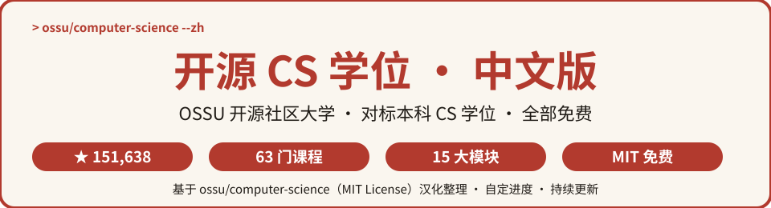
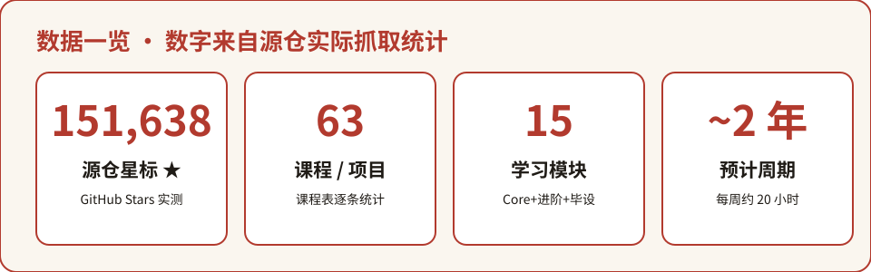
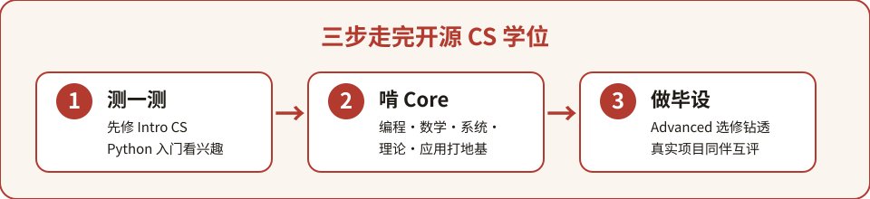

  

# computer-science-zh 中文版

> **全球最受欢迎的免费自学计算机科学学位 · 一站式中文课程体系**
> 源自 GitHub 上 **151,000+ ★** 的 [OSSU / computer-science](https://github.com/ossu/computer-science)（Open Source Society University，开源社区大学），按本科 CS 学位标准组织，覆盖 **15 大模块、63 门免费课程与项目**，全部可自定进度、随时开始。

---

## 目录

- [这是什么？](#这是什么)
- [为什么值得收藏](#为什么值得收藏)
- [数据一览](#数据一览)
- [快速开始](#快速开始)
- [分类清单](#分类清单)
- [完整课程索引](#完整课程索引)
- [常见问题 FAQ](#常见问题-faq)
- [参与贡献](#参与贡献)
- [致谢](#致谢)
- [许可声明](#许可声明)

---

## 这是什么？

**computer-science-zh（开源 CS 学位中文版）** 是对全球最知名的免费自学课程体系 [OSSU Computer Science](https://github.com/ossu/computer-science) 的中文二次开发项目。

源项目由 **Eric Douglas** 创立，现任由技术维护者 **Josh Hanson** 与学术维护者 **Waciuma Wanjohi** 带领全球社区共建。它按**本科计算机科学专业的学位要求**设计（去掉了非 CS 的通识课），课程全部选自哈佛、MIT、普林斯顿、斯坦福、华盛顿大学等世界顶级公开课，标准对标 [CS 2013 课程指南](https://github.com/ossu/computer-science/blob/master/CURRICULAR_GUIDELINES.md)。

它不是职业技能速成班，而是给想要**系统、扎实地掌握计算机科学基础**的人——从编程、数学、系统、理论到应用，一站式走完相当于一个 CS 本科的知识版图。

**中文版做了什么：**
- 🗺️ 把源 README 的 **15 大模块**整理成中文索引，模块名 / 课程名全部中英对照（见 [curriculum.md](curriculum.md)）；
- 📚 为每门课附上**中文译名 + 英文原名 + 课程链接**，免去你在英文长文里翻找；
- 🚀 提炼零基础起步、每周学时规划、毕业项目选择三类上手示例，内容完全依据源 README 的官方建议。

## 为什么值得收藏

- 🎓 **对标正规学位**：按本科 CS 培养方案设计，Core（必修）+ Advanced（选修方向）+ Final Project（毕业项目）完整闭环；
- 🆓 **几乎全免费**：课程材料全部开放，绝大多数课程可免费旁听；需要评分作业时 Coursera / edX 均提供助学金；
- ⏱️ **自定进度**：可独自学、可组队学，可按顺序也可并行（数学课常与入门编程课同时修）；
- 🌍 **全球社区陪跑**：官方 Discord 数万名学习者实时答疑，课程讨论分频道进行；
- 🇨🇳 **中文友好**：模块与课程全量中文索引，英文吃力也能按图索骥、对着链接上课。

## 数据一览

  

> 数字全部来自源仓 [README.md](https://raw.githubusercontent.com/ossu/computer-science/master/README.md) 实际抓取并脚本逐条统计（2026-10-05 核实）。

## 快速开始

### 学习路径三步

  

1. **测一测**：先修 **Intro CS** 那一门 Python 入门课——上完若还想继续，说明 CS 适合你；
2. **啃 Core**：按 Core programming → math → systems → theory → applications 顺序打地基，除非已掌握否则不要跳；
3. **选方向 + 做项目**：Core 全部修完后，在 Advanced CS 里挑一个方向钻透，最后用一个真实毕业项目收尾。

### 示例一：零基础如何开始

从 **Intro CS** 的《用 Python 入门计算机科学与编程》开始即可。源项目只要求你具备高中数学（代数、几何、预备微积分）。一门课约 14 周、每周 6–10 小时；先把这门学完，判断自己是否喜欢再进入 Core。

### 示例二：如何规划每周学时

源项目官方建议：**每周投入约 20 小时、规划得当约 2 年可走完**。可用官方的[时间线表格](https://docs.google.com/spreadsheets/d/1y2kMsIg9VaHMVmw35x_aH1hpty3V-ZMuV2jA13P_Cgo/copy)复制一份，填入你的开始日期与每周学时估算毕业时间。流行做法是**数学课与编程课并行**，同一天换着学不容易累。

### 示例三：如何做毕业项目

完成 Core 和你所选的 Advanced 方向后，**自选一个你能解决的真实问题**：可以从零做新产品，也可以改进你日常在用却嫌不顺手的工具。想要引导的话，可直接选一门项目导向课程，如示例里的 [Fullstack Open](https://fullstackopen.com/en/)、[Modern Robotics](https://modernrobotics.northwestern.edu) 或各 Data Science / Big Data 专项。

> 各模块推荐课程的中英对照与链接，见 [curriculum.md](curriculum.md)。

## 分类清单

完整 **15 大模块**（覆盖入门、核心必修、进阶方向、毕业项目）：

| 中文模块 | 英文模块名 | 课程数 | 一句话说明 |
| --- | --- | :--: | --- |
| 入门计算机科学 | Intro CS | 1 | 用 Python 体验 CS 全貌，判断是否适合自己 |
| 核心编程 | Core Programming | 5 | 函数式 / 面向对象 / 设计模式 / 软件架构 |
| 核心数学 | Core Math | 4 | 微积分 + 计算机科学数学（离散、概率、证明） |
| CS 工具 | CS Tools | 1 | Shell、Vim、命令行、版本控制等「缺失的学期」 |
| 核心系统 | Core Systems | 4 | 从与非门造计算机、操作系统、计算机网络 |
| 核心理论 | Core Theory | 2 | Stanford 算法设计与分析（上下） |
| 核心安全 | Core Security | 5 | 安全基础 + 安全编码 + 漏洞识别（二选一） |
| 核心应用 | Core Applications | 6 | 数据库、机器学习、计算机图形学、软件工程 |
| 核心伦理 | Core Ethics | 3 | 技术伦理、知识产权、数据隐私 |
| 进阶编程 | Advanced Programming | 6 | 并行计算、编译器、Haskell/Prolog、调试测试 |
| 进阶系统 | Advanced Systems | 3 | MIT 计算结构：数字电路 / 体系结构 / 计算机组织 |
| 进阶理论 | Advanced Theory | 3 | 计算理论、计算几何、算法博弈论 |
| 进阶信息安全 | Advanced Information Security | 6 | Web 安全、取证、安全治理、安全软件开发 |
| 进阶数学 | Advanced Math | 5 | 线性代数、数值方法、形式逻辑、概率论 |
| 毕业项目 | Final Project | 9 | 自选真实问题，由全球同伴互评 |

## 完整课程索引

📄 **[curriculum.md](curriculum.md)** — 收录全部 **63 门课程 / 项目**的**中文译名 + 英文原名 + 来源链接**，按 15 个模块分组，点开即上课。

- 🌐 在线课程站：[cs.ossu.dev](https://cs.ossu.dev)
- 📄 源仓 README（英文原文）：[ossu/computer-science](https://github.com/ossu/computer-science)
- 📐 课程标准：[CS 2013 本科课程指南](https://github.com/ossu/computer-science/blob/master/CURRICULAR_GUIDELINES.md)

## 常见问题 FAQ

**Q1：零基础真的能学完吗？要多久？**
可以。源项目就是为自学者设计的。按官方说法，每周约 20 小时、规划得当约 2 年走完；时间不够就拉长，进度完全自定。

**Q2：要花很多钱吗？**
几乎不花钱。课程材料全部免费；部分课程若要评分 / 作业 / 证书会收费，但 Coursera 与 edX 都提供助学金。源项目原话：你买不到成功，按自己的时间和预算决定花多少。

**Q3：必须按顺序一门一门学吗？**
Core CS 建议从上到下顺序学，除非你确定已掌握该内容；也有人并行修数学课与入门课。Advanced CS 是选修，选一个方向把它修透即可，不必每个子方向都学。

**Q4：学不完 / 跟不上怎么办？**
加入官方 [Discord](https://discord.gg/wuytwK5s9h)，每门课都有专属讨论频道；也可 Fork 源仓库当自己的看板，学完一门打一个 ✅。

**Q5：这个中文版和源项目是什么关系？**
本项目是中文**索引与翻译**，不含课程视频与教材原文。所有课程链接都跳转到 MIT / Harvard / Stanford 等开课机构的官方页面，版权归开课方。

## 参与贡献

- 🐛 发现课程译名或链接错误：提 Issue；
- 🌐 补充 / 修正中文课程名：Fork 后修改 [curriculum.md](curriculum.md) 提 PR；
- 📝 分享你的学习路线与踩坑经验：欢迎在 Issue 或 Discussions 交流。

## 致谢

- 感谢 OSSU 创始人 **Eric Douglas** 与技术 / 学术维护者 **Josh Hanson、Waciuma Wanjohi** 及全体贡献者共建 [ossu/computer-science](https://github.com/ossu/computer-science)；
- 感谢 Harvard、MIT、Stanford、Princeton、华盛顿大学等开课机构把最好的课程免费开放；
- 感谢每一位正在自学路上的你 🌟

## 许可声明

- 本仓库代码与文档：**MIT License**（见 [LICENSE](LICENSE)）；
- 源项目 [ossu/computer-science](https://github.com/ossu/computer-science)：**MIT License**（Copyright (c) 2015-2023 Open Source Society University）；
- 第三方声明与完整署名见 [THIRD_PARTY_NOTICES.md](THIRD_PARTY_NOTICES.md)。
